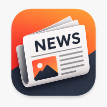

# 📰 SubhaTak – Modern News App

> Stay informed with the latest headlines from around the world. **SubhaTak** is a modern Android news application built using **Kotlin** and the traditional **XML View System**, following the **MVVM architecture** and Material Design principles to deliver a fast, clean, and intuitive news reading experience.

<p align="center">
  
</p>

<p align="center">


</p>

---

# 📖 Overview

**SubhaTak** is a feature-rich Android news application that delivers real-time news from trusted sources through a clean and responsive interface.

Designed with scalability and maintainability in mind, the app follows the **MVVM architecture**, making it easy to extend with additional features while ensuring a smooth user experience.

Whether you're interested in technology, sports, business, health, science, or entertainment, SubhaTak helps you stay updated anytime and anywhere.

---

# ✨ Features

### 📰 News Categories

* Top Headlines
* Business
* Technology
* Sports
* Entertainment
* Science
* Health
* General News

### 🔍 Search

* Search news by keywords
* Instant search results
* Browse articles from multiple publishers

### ❤️ User Experience

* Beautiful Material Design interface
* Responsive layouts
* Swipe-to-refresh
* Fast article loading
* Smooth animations
* Progress indicators while loading

### 🌙 Appearance

* Light Theme
* Dark Theme
* Dynamic UI Components

### 📱 News Details

* Full article preview
* High-quality news images
* Author information
* Publication date
* News source
* Open full article in browser

### 🔗 Sharing

* Share articles with friends
* Open articles in external browser
* Copy article links

### 🖼️ Image Loading

* Efficient image loading
* Placeholder shimmer effect
* Error handling for broken images

---

# 🏗️ Architecture

The project follows the **MVVM (Model–View–ViewModel)** architecture.

```id="o3zb0h"
Presentation (Activities / Fragments)
            │
            ▼
        ViewModel
            │
            ▼
       Repository
            │
            ▼
         News API
```

### Benefits

* Separation of Concerns
* Lifecycle-aware components
* Easy testing
* Scalable architecture
* Clean and maintainable code

---

# 🛠️ Tech Stack

| Technology           | Purpose               |
| -------------------- | --------------------- |
| Kotlin               | Programming Language  |
| XML                  | User Interface        |
| MVVM                 | Architecture          |
| Retrofit             | REST API Calls        |
| Gson                 | JSON Parsing          |
| Coroutines           | Background Tasks      |
| LiveData / StateFlow | Reactive UI           |
| ViewModel            | UI State Management   |
| Glide / Coil         | Image Loading         |
| RecyclerView         | Display News Articles |
| Material Components  | UI Design             |

---

# 📂 Project Structure

```id="me6vms"
app
│
├── api
│
├── data
│
├── model
│
├── repository
│
├── ui
│   ├── activities
│   ├── adapters
│   ├── fragments
│   ├── dialogs
│   └── utils
│
├── viewmodel
│
└── MainActivity.kt
```


# 🚀 Getting Started

## Prerequisites

* Android Studio (Latest Stable Version)
* Android SDK 24+
* Kotlin
* Internet Connection
* News API Key

---

## Installation

Clone the repository:

```bash id="pnlmwb"
git clone https://github.com/your-username/SubhaTak.git
```

Navigate into the project:

```bash id="hhsv3u"
cd SubhaTak
```

Open the project in Android Studio, let Gradle sync, add your API key, and run the application on an emulator or Android device.

---

# 🔑 API Configuration

1. Get your API key from **NewsAPI**.
2. Add the key to your configuration file (or `local.properties`).
3. Build and run the project.

> **Note:** Never commit your API key to a public repository.

---

# 📚 Learning Outcomes

This project demonstrates:

* MVVM Architecture
* REST API Integration
* Retrofit Networking
* Coroutines
* RecyclerView
* Material Design Components
* XML Layouts
* View Binding
* Image Loading
* Search Functionality
* Theme Switching
* Error Handling
* Repository Pattern

---

# 🎯 Key Highlights

* Modern Material Design UI
* Clean MVVM Architecture
* REST API Integration
* Responsive Layouts
* Fast News Loading
* Smooth User Experience
* Dark Mode Support
* Search Functionality
* Share News
* Optimized Image Loading

---

# 🔮 Future Improvements

* [ ] Bookmark Articles
* [ ] Offline Reading
* [ ] Push Notifications
* [ ] Personalized News Feed
* [ ] Multi-language Support
* [ ] Pagination
* [ ] Voice Search
* [ ] Firebase Authentication
* [ ] Room Database
* [ ] DataStore Preferences
* [ ] Unit Tests
* [ ] GitHub Actions CI/CD

---

# 🤝 Contributing

Contributions are always welcome!

1. Fork the repository.
2. Create a feature branch.
3. Commit your changes.
4. Push your branch.
5. Open a Pull Request.

---

# 📄 License

This project is licensed under the MIT License.

---

# 👨‍💻 Author

**Dhairya Parikh**

Engineering Student • Android Developer • Kotlin Enthusiast

---

<p align="center">
⭐ If you like this project, don't forget to star the repository!
</p>

<p align="center">
Made with ❤️ using Kotlin, XML, and Android Studio.
</p>
